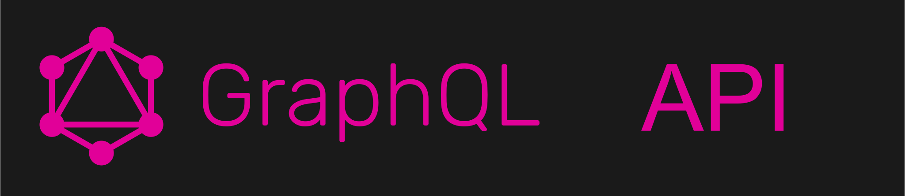

<!-- @format -->

  

## Hi there 👋

**$${\color{#d4b52d}Welcome \space \color{#4d4d4d}To \space \color{#3d3d3d}My \space \color{#c40002} GitHub \space \color{#bbbbbb} Page}$$**

$${\color{grey}This \space will  \space in  \space all  \space probability  \space remain  \space a  \space \color{#c40002}WIP \space \color{grey}!}$$

---

  

  <h2 align="center">👆 -------- 👆 -------- 👆</h2>
  <h4 position="absolute" top="50%" left="50%" transform="translate(-50%, -50%)" align="center">This View Looks Fantastic!</h4>

$${\color{#c40002}<h6\space  align="center">But\space unfortunately\space neither\space text\space  overlays\space  nor\space many\space other\space HTML\space formatting\space concepts\space work\space  with\space GitHub's\space Markdown\space parser.</h6>}$$

<h6 align="center">I'm already pushing my luck with inline-HTML as it's  
<i>BRrr  eaaaking...</i> 
MD Styling Rules by the 1000's!!</h6> 

<i>The heading "BRrr  eaaaking..." renders correctly (red text, @ 24px) in some MD parsers, in others it will not.</i>

Refer to [GitHub's MD Flavor Spec.](https://github.github.com/gfm/)

---

#### 🔭 I’m currently working on ...

> - Building an SPA | API Project to practice my development skills with the tools below.

#### 🌱 I’m busy learning ...

> - TypeScript
> - Nuxt
> - Vue
> - React
> - Pinia
> - Laravel
> - WordPress
> - Ionic Capacitor
> - Rust + WASM
> - GrapgQL for AI LLMs
> - Technical SEO 

#### 👯 I’m looking to collaborate on ...

- Business Development Projects with a global reach potential.
- I'm a founder/partner/consultant of a few small tech-related companies and a few standard bolts-n-nuts businesses.

#### 🤔 I’m looking for help with ...

Post-Quantum Encryption Solutions based on Rust and a WASM Browser interface.

#### 💬 Ask me about ...

> - Well anything basically. If I can help, I will. If I know, I'll share my knowledge, if I don't know, I go find out.

#### 📫 How to reach me:...

> - [LinkedIn](https://www.linkedin.com/in/andre-du-plessis-992a0329)
> - **[ X ](https://x.com/AndreDuP_ADPC)**
> - [DEV.TO](https://dev.to/andre_adpc)
> - [Stackoverflow](https://stackoverflow.com/users/19977074/andre?tab=profile)
> - [Bluesky](https://bsky.app/profile/andre-dup.bsky.social)
> - [Substack](https://andreduplessis.substack.com/)
> - [Facebook](https://www.facebook.com/RedDragonX5)

**Secure Confidential Contact Channels**

> - [Signal](https://github.com/Andre-ADPC/Andre-ADPC/blob/main/Assets/Image_Files/Andre-Signal-QRC.png)

---

#### Me the human ...

_🕷 —  Human, Tarantula Nebula | Consultant - Contractor - Nomad_

_🏷️ —  Dad-of-Four, Ex-Teleco engineer, entrepreneur, self-taught dev, interested in tech, science, and life on a broad scale. Always busy developing and learning. Currently Building Q-Droid._

_🏷️ —  I enjoy chatting about: Opinions, Facts and Practical Information regarding Entrepreneurship, Business Ventures, Software Development, Science & Tech. As I learn I write about it on Substack and here._

_🎓 —  Formal education, which was a looong time ago: - Electronics Eng, South Africa, Vaal University of Technology_

_🛖 —  Currently based in **Tbilisi, Georgia**_

> - 💬 [Signal](https://github.com/Andre-ADPC/Andre-ADPC/blob/main/Assets/Image_Files/Andre-Signal-QRC.png)
> - 📧 Catch me on [Email](mailto:andre.du.plessis@adpc-llc.com) if you'd like to connect that way.

- 😄 Pronouns: he/him

---

### ⚡ Fun fact: I blow bubbles 🫧!

Yes, the underwater kind. Scuba diving is a favourite pastime, and taking pictures and videos of all the strange critters to be found there is extremely rewarding in its own relaxing way.

---

### Tech Stack I Enjoy Using

### Some Frameworks & Tools I currently use 📗, are learning to, or plan to use 📘 ... Also becoming aware of "corrupted" FOSS📕, which I'll avoid using AMAP.

| Database Types          |         Platforms         |                   Other Tools |
| :---------------------- | :-----------------------: | ----------------------------: |
| MySQL 📗     | PlanetScale 📘 |        GitTower 📘 |
| PostgeSQL 📘 | ClickHouse 📘  |         Laragon 📗 |
| SQLite 📗    | SingleStore 📘 | MySQL Workbench 📗 |
| NoSQL 📘     |     AWS 📗     |       TablePlus 📗 |
| ~~Redis~~ 📕 |    Azure 📘    |      Cloudflare 📗 |
| Valkey 📘    |   Netlify 📗   |          Docker 📗 |

---

### [Hello Mauritz. May the chaos as an IT Tech supporter never cease, dude! 😄](https://www.facebook.com/mauritz.duplessis.319)

### [Hi Alicia. Done with that hacker yet? 🤩](https://www.linkedin.com/in/alicia-v-1096a463/)

_Just messing with my kids a bit. It keeps them on their toes! :wink:_

## More to Follow as I make New Discoveries

### Reveal or Drop-down Toggles

> 
 
  >  
 
  >    <strong>What is Lorem Ipsum?</strong>
  >  

>  <i>Lorem Ipsum is simply dummy text of the printing and typesetting industry. Lorem Ipsum has been the industry's standard dummy text ever <strong>since the 1500s</strong>, when an unknown printer took a galley of type and scrambled it to make a type specimen book. It has survived not only five centuries, but also the leap into electronic typesetting, remaining essentially unchanged. It was popularised in the 1960s with the release of Letraset sheets containing Lorem Ipsum passages, and more recently with desktop publishing software like Aldus PageMaker including versions of Lorem Ipsum.</i>

>

 
    
 
      <strong>Why do we use it?</strong>
    

<u><i>It is a long established fact that a reader will be distracted by the readable content of a page when looking at its layout. The point of using Lorem Ipsum is that it has a more-or-less normal distribution of letters, as opposed to using 'Content here, content here', making it look like readable English. Many desktop publishing packages and web page editors now use Lorem Ipsum as their default model text, and a search for 'lorem ipsum' will uncover many web sites still in their infancy. Various versions have evolved over the years, sometimes by accident, sometimes on purpose (injected humour and the like).</i></u>

---

## Text vs Image Placement

### You're Breathtaking

> <i>At the 2019 rendition of E3, an eccentric gamer in attendance interrupted Keanu Reeves' presentation of the role-playing game (RPG) Cyberpunk 2077, loudly claiming, “"You're breathtaking,"” which was directed at the actor-cum-presenter. The image macro used to build the "You're Breathtaking" meme generally features a still of Keanu Reeves pointing at someone in the audience in front of him - that someone is Peter Sark, though there are no images from Keanu's point of view that have since been used as part of the "You're Breathtaking" meme.</i>

<i>The snippets above were discovered on [Aravind Ramalingam's Blog.](https://www.raravind.com/blog/web-development/7-advanced-markdown-tips) Do go check it out he has a number of other tricks up his sleeve.</i>

---

### Interesting HTML Conundrums
There's a complete HTML document section down below, however, GitHub's MD parser seems to battle with how to handle this "intended mess". Opening this README.MD file in a browser reveals other differences between viewing the file via GitHub's User Profile Page vs viewing the transpiled Markdown in a browser via VS Code's UI in "Preview Mode".

<!DOCTYPE html>
<html lang="en">

<head>
    
</head>

<body>
    

        
        

            <h3>Sample</h3>
            
Snow-covered Mountains - A View To Kill For

        

    

</body>
</html>
