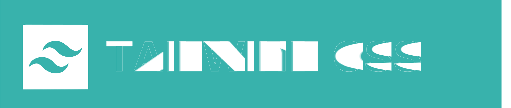

<!-- @format -->

  

## Hi there 👋

**$${\color{#c40002}Welcome \space \color{grey}To \space \color{orange}My \space \color{d8b92b} GitHub \space \color{3186bf} Page}$$**

$${\color{grey}This \space will  \space in  \space all  \space probability  \space remain  \space a  \space \color{#c40002}WIP \space \color{grey}!}$$

---

#### 🔭 I’m currently working on ...

> - Building an SPA | API Project to practice my development skills with the tools below.

#### 🌱 I’m busy learning ...

> - TypeScript
> - Nuxt
> - Vue
> - React
> - Pinia
> - Laravel
> - WordPress
> - Ionic Capacitor
> - Rust + WASM
> - GrapgQL + LLM
> - Technical SEO 

#### 👯 I’m looking to collaborate on ...

- Business Development Projects with a global reach potential.
- I'm a founder/partner/consultant of a few small tech-related companies and a few standard bolts-n-nuts businesses.

#### 🤔 I’m looking for help with ...

Post-Quantum Encryption Solutions based on Rust and a WASM Browser interface.

#### 💬 Ask me about ...

> - Well anything basically. If I can help, I will. If I know, I'll share my knowledge, if I don't know, I go find out.

#### 📫 How to reach me:...

> - [LinkedIn](https://www.linkedin.com/in/andre-du-plessis-992a0329)
> - **[ X ](https://x.com/AndreDuP_ADPC)**
> - [DEV.TO](https://dev.to/andre_adpc)
> - [Stackoverflow](https://stackoverflow.com/users/19977074/andre?tab=profile)
> - [Bluesky](https://bsky.app/profile/andre-dup.bsky.social)
> - [Substack](https://andreduplessis.substack.com/)
> - [Facebook](https://www.facebook.com/RedDragonX5)

**Secure Confidential Contact Channels**

> - [Signal](https://github.com/Andre-ADPC/Andre-ADPC/blob/main/Assets/Image_Files/Andre-Signal-QRC.png)

---

#### Me the human ...

_🏷️ —  Dad-of-Four, Ex-Teleco engineer, entrepreneur, self-taught dev, interested in tech, science, and life on a broad scale. Always busy developing and learning. Currently Building Q-Droid._

_🏷️ —  I enjoy chatting about: Opinions, Facts and Practical Information regarding Entrepreneurship, Business Ventures, Software Development, Science & Tech. As I learn I write about it on Substack and here._

_🎓Formal education, which was a looong time ago: - Electronics Eng, South Africa, Vaal University of Technology_

_🛖 Currently based in **Tbilisi, Georgia**_

> - 💬 [Signal](https://github.com/Andre-ADPC/Andre-ADPC/blob/main/Assets/Image_Files/Andre-Signal-QRC.png)
> - 📧 Catch me on [Email](mailto:andre.du.plessis@adpc-llc.com) if you'd like to connect that way.

- 😄 Pronouns: he/him

---

### ⚡ Fun fact: I blow bubbles 🫧!

Yes, the underwater kind. Scuba diving is a favourite pastime, and taking pictures and videos of all the strange critters to be found there is extremely rewarding in its own relaxing way.

---

### Tech Stack I Enjoy Using

### Other Frameworks & Tools I curently use📗 or are learning to or plan to use📘

| Database Types         |    Database Platforms    |                  Other Tools |
| :--------------------- | :----------------------: | ---------------------------: |
| MySQL📗     | PlanetScale📘 |        GitTower📘 |
| PostgeSQL📘 | ClickHouse📘  |         Laragon📗 |
| SQLite📗    | SingleStore📘 | MySQL Workbench📗 |
| NoSQL📘     |     AWS📗/sup>      |       TablePlus📗 |
| ~~Redis~~📕 |    Valkey📘   |          Docker📗 |

---

### [Hello Mauritz. May the chaos as an IT Tech supporter never cease, dude! 😄](https://www.facebook.com/mauritz.duplessis.319)

### [Hi Alicia. Done with that hacker yet? 🤩](https://www.linkedin.com/in/alicia-v-1096a463/)

_Just messing with my kids a bit. It keeps them on their toes! :wink:_
